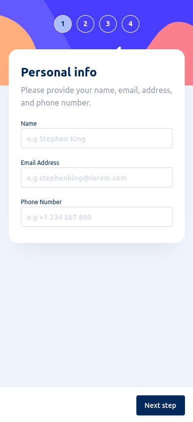
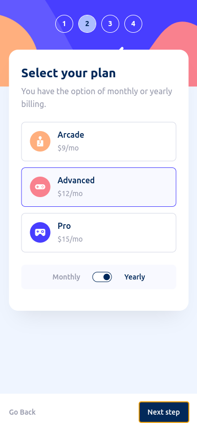
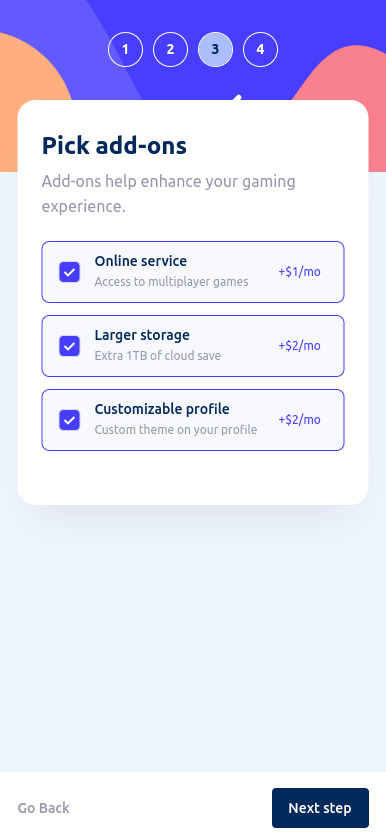
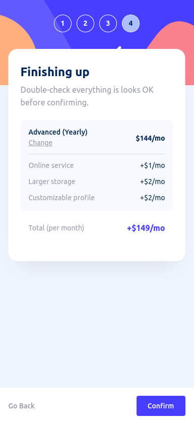
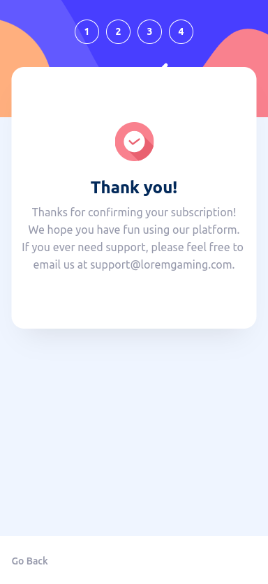

# Frontend Mentor - Multi-step form solution

This is a solution to the [Multi-step form challenge on Frontend Mentor](https://www.frontendmentor.io/challenges/multistep-form-YVAnSdqQBJ). Frontend Mentor challenges help you improve your coding skills by building realistic projects. 

## Table of contents

- [Overview](#overview)
  - [The challenge](#the-challenge)
  - [Screenshot](#screenshot)
  - [Links](#links)
- [My process](#my-process)
  - [Built with](#built-with)
  - [What I learned](#what-i-learned)
  - [Continued development](#continued-development)
- [Author](#author)

**Note: Delete this note and update the table of contents based on what sections you keep.**

## Overview

### The challenge

Users should be able to:

- [x] Complete each step of the sequence
- [x] Go back to a previous step to update their selections
- [x] See a summary of their selections on the final step and confirm their order
- [x] View the optimal layout for the interface depending on their device's screen size
- [x] See hover and focus states for all interactive elements on the page
- [ ] Receive form validation messages if:
  - A field has been missed
  - The email address is not formatted correctly
  - A step is submitted, but no selection has been made

### Screenshot

  
  
  
  
  
.png)  
.png)  
.png)  
.png)  
.png)  

### Links

- Solution URL: [github](https://github.com/hyunwlee-dev/front-end-mentor/tree/deploy/manual/apps/multi-step-form)
- Live Site URL: [Add live site URL here](https://your-live-site-url.com)

## My process

### Built with

- [React](https://reactjs.org/) - JS library
- [Next.js](https://nextjs.org/) - React framework
- [Styled Components](https://styled-components.com/) - For styles

- Redux-tool-kit
- Semantic HTML5 markup
- Responsive-web

### What I learned

1. 'white-space: pre-wrap'을 사용하여 줄 바꿈을 유지할 수 있었다.  

To see how you can add code snippets, see below:

```html
return (<>
  ...
  <PreWrap>{'Thanks for confirming your subscription!\nWe hope you have fun using our platform.\nIf you ever need support, please feel free to email us at support@loremgaming.com.'}<PreWrap>
  ...
</>);
```

```css
const PreWrap = styled.p`
  white-space: pre-wrap;
`;
```

  

2. redux-tool-kit

Redux를 보다 쉽고 효율적으로 사용할 수 있었다.  

### Continued development

- Receive form validation messages if:

  - [ ] A field has been missed

  - [ ] The email address is not formatted correctly

  - [ ] A step is submitted, but no selection has been made

## Author

- Website - [Add your name here](https://www.your-site.com)
- Frontend Mentor - [@yourusername](https://www.frontendmentor.io/profile/yourusername)
- Twitter - [@yourusername](https://www.twitter.com/yourusername)

